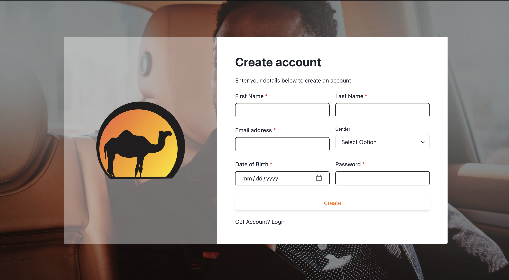
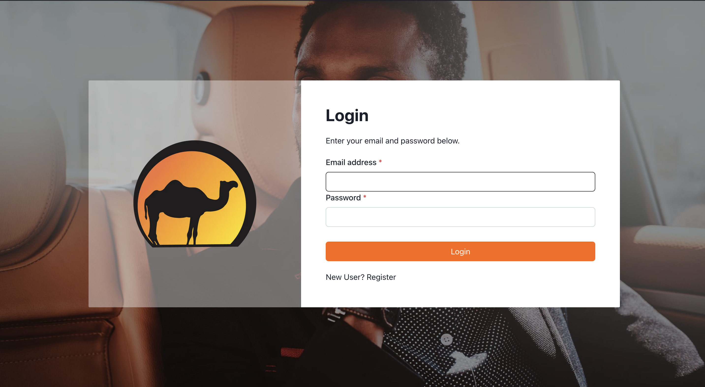
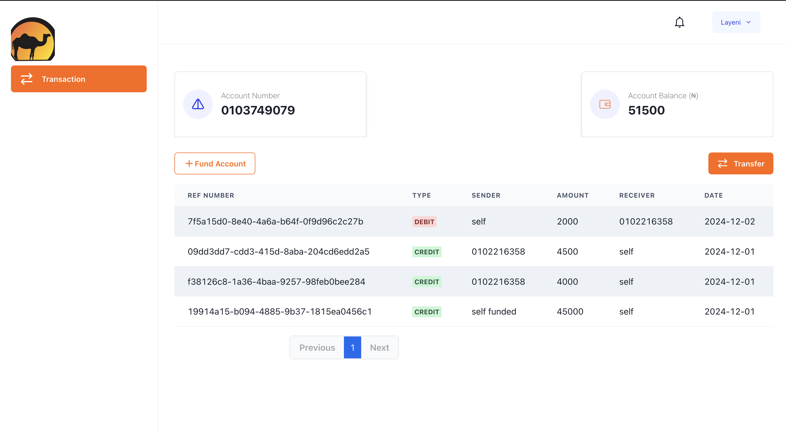
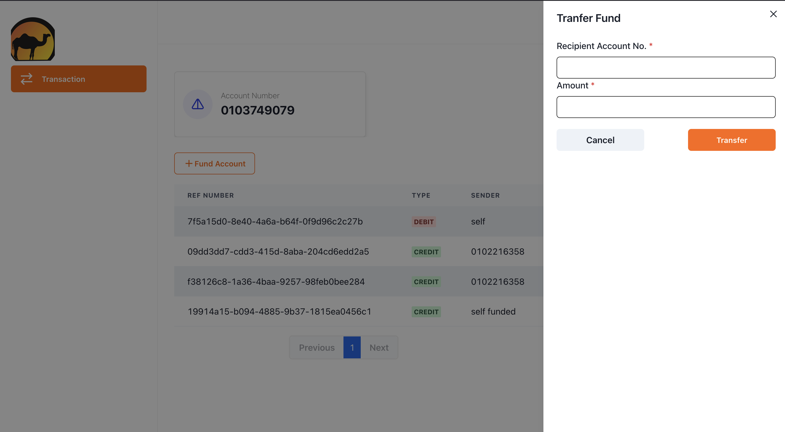

# Leadway User Transactions Frontend

This is a Frontend web application built with Nextjs that helps users do the following:

1. Create an account,
2. Fund the account
3. Transfer fund to other account users
4. See the history of their transactions

## Project setup

- Clone/download this repository file and `cd` into it (`cd lead-account-fe`) and run

```bash
$ npm install
```

## Run the project

```bash
# development
$ npm run dev

# production mode
$ npm run start:prod
```

## Screenshots








## Resources

Check out a few resources that may come in handy when working with Nextjs:

- [NextJS](https://nextjs.org/)
- [ChakraUi](https://v2.chakra-ui.com/)
- [cookies-next](https://www.npmjs.com/package/cookies-next)
- [Axios](https://axios-http.com/docs/intro)

## Stay in touch

- Author - [Adedeji Adelanwa](https://github.com/adedejiadelanwa)

## License

Nest is [MIT licensed](https://github.com/nestjs/nest/blob/master/LICENSE).
